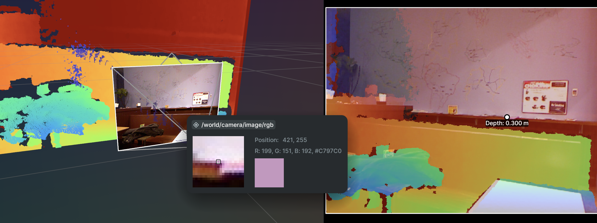
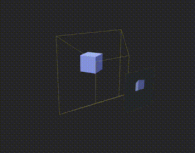

# Probe




[Rerun](https://rerun.io/) includes a movable 'camera', which renders its view to a render target. We can then sample this
render target to see the pixel colours at particular points on the render target.

This repo is an attempt to recreate this in bevy.



The most complex element is implementing 'readback' of the sample pixels from the gpu.

There are several application to this setup. We could, for instance, render meshes in the scene to a particular render layer with specific colours, and then do 'gpu picking', rather than having to do raycasting on the cpu.


I'm effectively tying to recreate unity's shadergraph, but for bevy. We can define different nodes. One important node is a 'SourceNode' (there may be a better name), which effectivelt represents us putting a Camera in the scene, and rendering that Camera's view to a render texture. The Node will have internal state (i.e. the updated render texture). It would be good then to be able to add a 'probe' node, where we can extract (via gpu readback) a kernel of pixels at various coordinates in the render texture. Can you discus how we may enumerate the whole zoo/pantheon of node types, and how they are connected into an overall pipeline. Obviolsy I'm pretty sure bevy has a pipeline under the hood anyay, but this is more a 'data pipeline' for extracting and transforming data within the scene


We could integrate this with burn's shaders?


```rust

#[derive(Debug, Clone, PartialEq)]
pub enum NodeType {
    Source,      // Generates data (cameras, procedural sources)
    Transform,   // Transforms data (filters, math operations)
    Sink,        // Consumes data (file output, display)
    Probe,       // Extracts specific data samples
    Compute,     // GPU compute operations
    Conditional, // Branching logic
}

```
